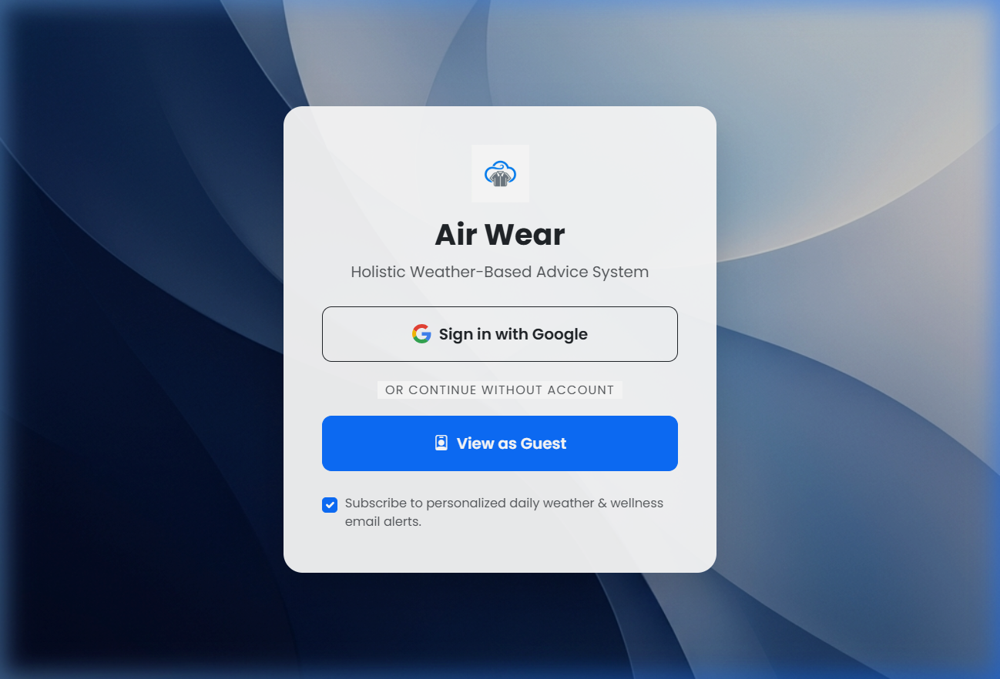
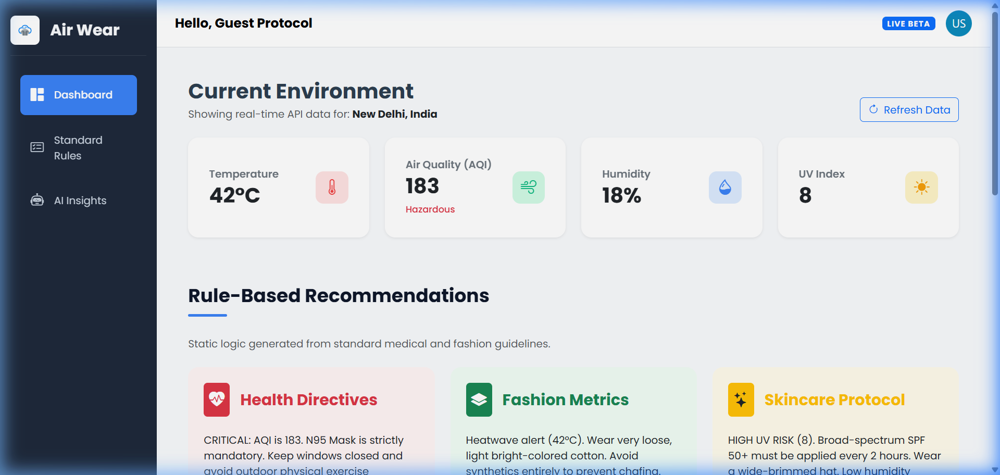

# 🌤️ Air Wear — Weather-Based Lifestyle Recommendation Dashboard

> A real-time environmental dashboard that converts live weather and air quality data into actionable health, fashion, and skincare recommendations.

🔗 **Live Demo:** [md-abidhussain.github.io/air-wear](https://md-abidhussain.github.io/air-wear/)

---

## 📌 Overview

Most weather apps show raw numbers — AQI: 183, Temp: 42°C. Air Wear answers the actual question: *what should I do about it?*

It pulls live data from two external APIs and runs it through a rule-based recommendation engine to generate specific, actionable advice across three domains: health, fashion, and skincare.

---

## 📸 Screenshots

| Login Page | Dashboard |
|---|---|
|  |  |

---

## ✨ Features

- 🌡️ **Real-Time Environmental Data** — Live temperature, AQI, humidity, and UV index via OpenWeatherMap and WAQI APIs
- 🫁 **Health Directives** — Mask recommendations, outdoor exposure guidance based on WHO AQI thresholds
- 👕 **Fashion Suggestions** — Fabric and layering advice based on temperature and humidity
- 🧴 **Skincare Protocol** — SPF and moisturizer recommendations based on UV index and humidity levels
- 👤 **Guest Mode** — Use without any account required
- 🎨 **Clean Dashboard UI** — Sidebar navigation, card-based layout, color-coded AQI indicators

---

## 🛠️ Tech Stack

| Layer | Technology |
|---|---|
| Frontend | HTML5, CSS3, Bootstrap 5 |
| Logic | JavaScript (ES6), Async/Await |
| Weather API | OpenWeatherMap |
| Air Quality API | WAQI (World Air Quality Index) |
| Deployment | GitHub Pages + GitHub Actions CI/CD |

---

## 🏗️ How It Works

```
User Opens Dashboard
        │
        ▼
fetchAllData() — parallel API calls
  ├── OpenWeatherMap → temp, humidity
  └── WAQI → AQI, UV index
        │
        ▼
globalWeatherData object updated
        │
        ▼
generateRuleBasedAdvice()
  ├── AQI thresholds → health directive
  ├── Temperature range → fashion suggestion
  └── UV + humidity → skincare protocol
        │
        ▼
DOM updated dynamically
```

---

## 📂 Project Structure

```
├── index.html              # Login / entry page
├── dashboard.html          # Main dashboard UI
├── css/
│   └── main_style.css      # Custom styles
├── js/
│   ├── weather_api.js      # API calls + rule engine + DOM updates
│   ├── login_auth.js       # Guest/login session handling
│   └── env.js              # API key config (excluded from VCS)
├── assets/images/          # Logo and background
└── .github/workflows/
    └── deploy.yml          # GitHub Actions auto-deploy
```

---

## 🚀 Local Setup

**1. Clone the repo**
```bash
git clone https://github.com/md-abidhussain/air-wear.git
cd air-wear
```

**2. Add your API keys**

Edit `js/env.js`:
```javascript
const ENV = {
    OPENWEATHER_KEY: 'your_openweathermap_key',
    WAQI_KEY: 'your_waqi_key'
};
```

Get free keys at:
- [openweathermap.org/api](https://openweathermap.org/api)
- [aqicn.org/data-platform/token](https://aqicn.org/data-platform/token/)

**3. Open in browser**
```bash
# No build step needed — open directly
open index.html
```

---

## ⚠️ Known Limitations

- Authentication is localStorage-based — not production-secure; real OAuth/Firebase integration is a planned future improvement
- API keys are currently client-side — a backend proxy would be required for production deployment
- Location is hardcoded to New Delhi — dynamic geolocation is a planned feature

---

## 🔮 Future Improvements

- Dynamic geolocation — recommendations for user's actual location
- Firebase Auth — real Google OAuth integration
- Backend API proxy — move keys server-side
- Email alerts — daily weather + wellness digest
- Gemini API integration — natural language advisory instead of rule-based templates

---

## 👨💻 Author

**Mohd Abid Hussain** — CSE @ Jamia Hamdard
[LinkedIn](https://www.linkedin.com/in/md-abidhussain) · [GitHub](https://github.com/md-abidhussain)

---

*Deployed via GitHub Pages with automated CI/CD through GitHub Actions*
